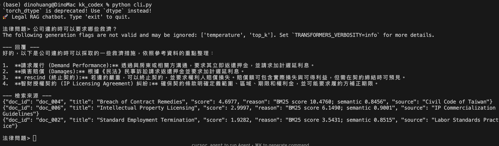
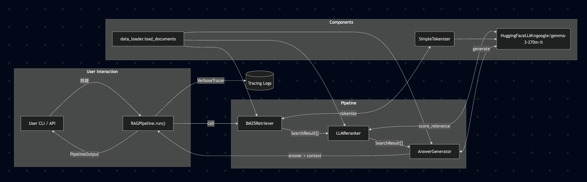
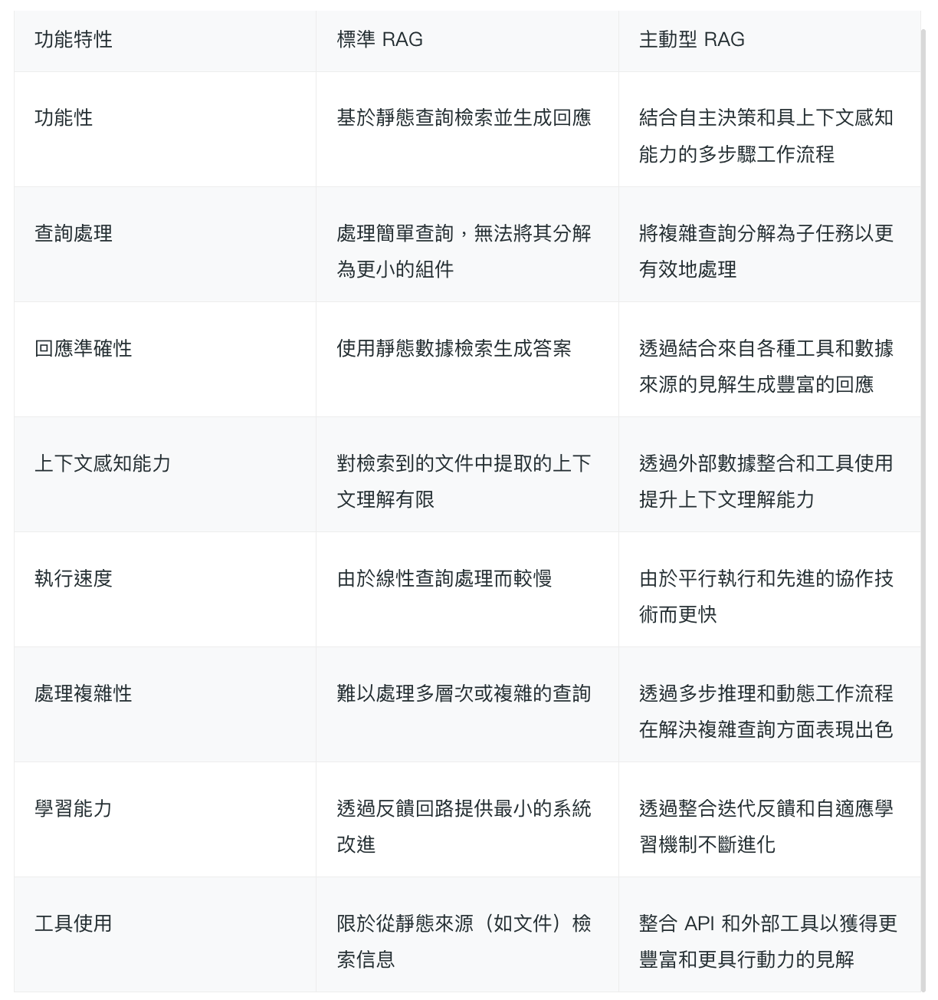
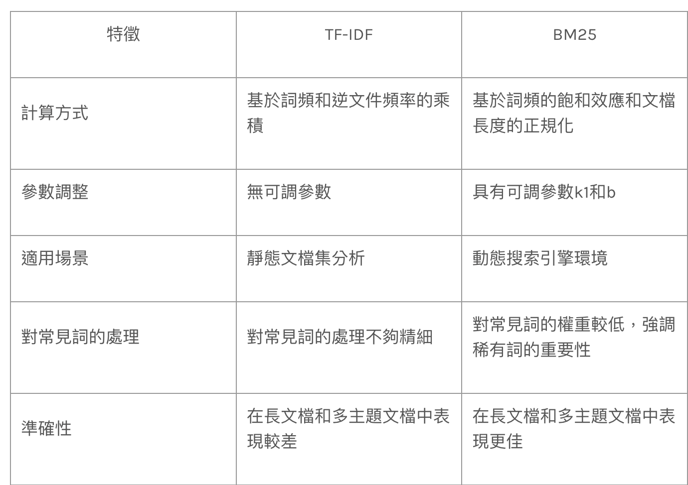

# GC Data Scientist Final Interview — Topic A

- **主題**：LLM 流程設計與 RAG 方法復現（Python）
- **目標**：依 pseudocode 完成「檢索 → 排序 → 生成」的法律諮詢 Chatbot
- **交付**：Gemma 驅動的可執行原型、CLI Demo、可觀測管線與商業價值分析

---

## CLI Demo

---

## 系統架構

---

##  商業應用機會

1. **客服增強**：個人化、精準的回應。
2. **互動式知識庫**：員工可查政策、合規與既有案例，加速決策、降低錯誤。
3. **合規助理**：串接法規資料庫核對操作是否合規，及早發現風險、保持指導即時。

---

## 主動型 RAG vs. 標準 RAG

總結來說，標準 RAG 適用於基本的問答和研究，而主動型 RAG 則在複雜和數據密集型應用中佔據主導地位。

---

##  關鍵成果 (Key Results)

1. **降低諮詢成本**：自動處理例行問題，釋放專業人力並節省 LLM 計算成本。
2. **提升自助率**：24/7 回覆縮短解決時間，提高首次解決率與客戶體驗。
3. **降低法律風險**：根據驗證文件回答，避免幻覺，減少罰則、訴訟與合規失誤。

---

# Thank You

**Thank you for your time!**

- 📧 Email：dino.1g.yc@gmail.com
- 💼 LinkedIn：@Dino Huang
- 📱 Phone：+886-986-675-949

---

## Pseudocode 對照

| Pseudocode 步驟 | Python 模組 |
| --- | --- |
| 資料準備 | `data_loader.py` · `preprocessing.py` |
| 檢索候選 | `retriever.py` (BM25) |
| LLM 排序 | `ranker.py` · `llm.py` |
| 回答生成 | `generator.py` |
| 管線輸出 | `pipeline.py` · `factory.py` · `cli.py` |

---

## 專案中的 BM25（`retriever.py`）

- **資料預處理**：`SimpleTokenizer` 會把英文小寫化、移除停用詞，並將中文拆成字 + 連續雙字組，確保判斷「違約、賠償」等關鍵詞。
- **索引初始化**：
  - 對每份 `Document` 建立 `Counter`，記錄詞頻 (TF)。
  - 同步累積 `document_frequency`、`doc_lengths`，並計算 `avg_doc_len`。
  - 以 `k1=1.5`、`b=0.75` 作為飽和／長度因子。
- **IDF 快取**：`_idf()` 以 log-smoothing 計算 `log((N - df + 0.5)/(df + 0.5) + 1)`，並寫入快取避免重複運算。
- **查詢流程**：
  - 將使用者問題 token 化後，對語料逐一計分：
    \\[ score(q, d) = \sum_{t \in q} IDF(t) \cdot \frac{TF_{t,d}(k_1 + 1)}{TF_{t,d} + k_1(1 - b + b \cdot |d|/avgdl)} \\
  - 只保留分數 > 0 的文件，排序並回傳前 `top_k` 的 `SearchResult`。
- **設計重點**：純 Python、無外部依賴，方便在 Demo 中拆解 score 來源 (`reason` 字段可顯示 BM25 分數)。

---

## 流程拆解

1. **Retrieval**：BM25 建立 TF/IDF 統計，查詢時計算分數取 Top-K。
2. **Re-ranking**：將問題/候選段落餵入 Gemma，取得平均向量 → 餘弦相似度；與 BM25 分數依 `alpha` 混合。
3. **Generation**：整理 Top-N 引文為 Chat Template，指派 Gemma 生成條列式回答與提醒。
4. **輸出**：`PipelineOutput` 回傳最終回答、引用來源；`VerboseTracer` 保留完整 trace。

---

## 模組職責

- `data_loader.py`：JSONL → `Document` dataclass，保留來源/法域/標籤。
- `preprocessing.py`：中英混合 tokenizer + 中文字/雙字組擴展。
- `retriever.py`：BM25 實作（預計算詞頻、長度、IDF），對應 pseudocode 檢索步驟。
- `ranker.py` & `llm.py`：`LLMReranker` 呼叫 Gemma 進行語義評分與回答生成。
- `generator.py`：構建 Prompt，附上來源標籤與行動建議。
- `pipeline.py` & `factory.py`：統整流程、註冊 `HF_TOKEN`/`HF_MODEL_ID`。

---

## 可觀測性 · 驗證

- **VerboseTracer**：輸出斷詞、BM25 計分、Gemma 嵌入結果與 Prompt；便於稽核。
- **CLI Demo**：`python cli.py --verbose` 即時查看 trace 與回答品質。
- **離線評估建議**：Recall@K、nDCG、Gemma 與人工評估的答覆品質。
- **線上監控建議**：使用者評分、升級率、Gemma 推論延遲（p50/p95）。

---

## 擴充路線

- **LLM 替換**：遵守 `BaseLLM` 介面即可換 GPT、Claude、本地大模型。
- **Retrieval 升級**：向量檢索、Hybrid RAG；接口維持 `retrieve()` 即可。
- **知識庫擴充**：導入專屬法規、合約範本、FAQ；利用 `tags` 控制權限。
- **守門機制**：低信心時升級真人；透過 tracer 快速回溯決策過程。

---

## Demo 與落地藍圖

- **CLI**：`python cli.py` / `--verbose` — 即時回答與引用追蹤。
- **程式用法**：`pipeline = build_pipeline(...); pipeline.run(question)`。
- **部署建議**：
  1. FastAPI 封裝 RAGPipeline。
  2. 加入 Redis/Varnish cache、OpenTelemetry tracing。
  3. 介接 Web/Line/Slack Bot 提供客戶或內部諮詢。

---

## 小結

- 已依 pseudocode 完整復現 RAG 流程；Gemma LLM 兼顧語義排序與生成。
- 模組化設計 + VerboseTracer 讓流程可觀測、易維護、易擴充。
- 下一步：插入企業級 LLM、建立自動評估、導入多輪對話與權限控管。
  
> 此為一般資訊，建議諮詢律師。

---

# Thank You

**Thank you for your time!**

- 📧 Email：dino.1g.yc@gmail.com
- 💼 LinkedIn：@Dino Huang
- 📱 Phone：+886-986-675-949
