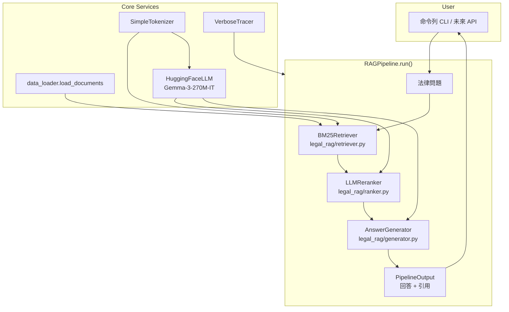

# Slide 1 — Briefing Scope
- **Topic A**：GC Data Scientist Final Interview — LLM 流程設計與 RAG 方法復現（Python）。
- **目標**：依據提供的 pseudocode，完成「檢索 → 排序 → 生成」的法律諮詢 Chatbot。
- **交付**：可執行的 Python 原型、可追蹤的流程與模組化設計、CLI 示範與 verbose tracing。

---

# Slide 2 — Pseudocode 對照

| Pseudocode 步驟 | Python 對應模組 |
| --- | --- |
| 準備知識庫 | `legal_rag/data_loader.py`, `legal_rag/preprocessing.py` |
| 檢索候選 | `legal_rag/retriever.py` (BM25) |
| LLM 排序 | `legal_rag/ranker.py`, `legal_rag/llm.py` |
| 生成回答 | `legal_rag/generator.py` |
| 回傳結果 | `legal_rag/pipeline.py`, `legal_rag/factory.py`, `cli.py` |

---

# Slide 3 — 系統架構圖

---

# Slide 4 — 流程拆解
- **Retrieval**：`BM25Retriever` 預先建立詞頻、文件長度與 IDF；查詢時計算 BM25 取得 Top-K。
- **Re-ranking**：`HuggingFaceLLM`（Gemma-3-270M-IT）將問題與候選內容嵌入成向量，使用餘弦相似度融合 BM25 分數。
- **Generation**：`AnswerGenerator` 組裝帶來源的上下文片段，由 `HuggingFaceLLM.generate` 產出指令式回覆。
- **Output**：`PipelineOutput` 回傳回答與引用；`VerboseTracer` 全程記錄細節，支援稽核與除錯。

---

# Slide 5 — 模組職責與互動
- `legal_rag/data_loader.py`：JSONL → `Document`。
- `legal_rag/preprocessing.py`：中英混合 tokenizer、中文字 + 雙字組。
- `legal_rag/llm.py`：定義 LLM 介面；`HuggingFaceLLM` 以 Gemma 指令模型處理語義排序與答覆生成。
- `legal_rag/factory.py`：統一組裝元件，方便在 CLI/測試中重複使用。
- `cli.py`：命令列互動並支援 `--verbose`，示範完整流程。

---

# Slide 6 — 可觀測性與驗證
- `VerboseTracer` 可逐步輸出：token 化結果、BM25 分數、語義調整、提示組裝。
- CLI 示範：`python3 cli.py --verbose`。
- 推薦的離線檢驗：Recall@K、nDCG、F1（語義排名）、人工抽樣審閱。
- 推薦的線上監控：使用者滿意度、手動升級率、延遲（p50/p95）。

---

# Slide 7 — 擴充與替換策略
- **LLM**：依照 `BaseLLM` 介面替換為 GPT、Claude、或企業內部模型。
- **Retrieval**：保持 `retrieve()` 簽章即可遷移到向量檢索或混合檢索。
- **Corpus**：加入專屬法規、合約範本、案例摘要；利用 `tags/jurisdiction` 管理權限。
- **守門機制**：在 generator 加入只要信心不足就 escalate 的判斷；透過 tracer 留存決策路徑。

---

# Slide 8 — 示範與落地
- CLI Demo：`python3 cli.py` — 即時回覆與引用追蹤。
- 程式呼叫：`build_pipeline(...)` → `pipeline.run(question)`。
- Deployment Blueprint：
  1. FastAPI 封裝 `pipeline.run`。
  2. 加上 Redis/Varnish cache 與 OpenTelemetry tracing。
  3. 介接 Slack/Line Bot 或 Web 前端。

---

# Slide 9 — 小結
- 已完整復現 pseudocode 的 RAG 流程，並以模組化方式展現可替換性。
- 透過 VerboseTracer、清楚的 dataclass 與 CLI，確保可追蹤與可測試。
- 下一步：插入企業級 LLM、導入向量檢索、加上品質量測與多輪對話能力。
