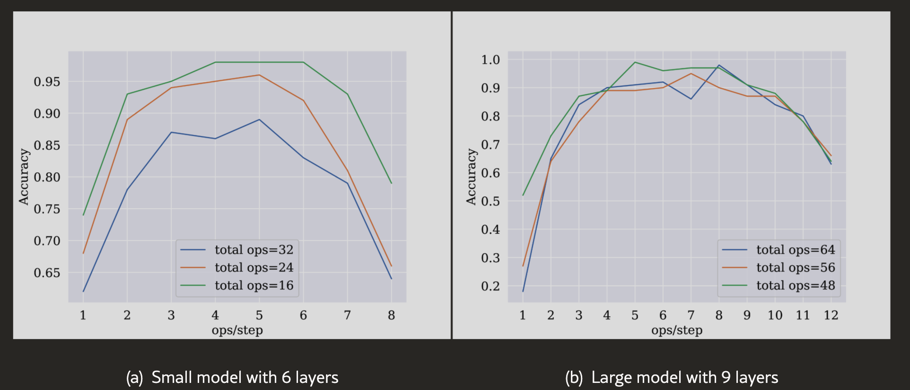

---
# Thank You

**Thank you for your time!**

- 📧 Email：dino.1g.yc@gmail.com
- 💼 LinkedIn：@Dino Huang
- 📱 Phone：+886-986-675-949

---
# 參考資料與延伸閱讀

- [Context-Aware RAG Benchmark](https://arxiv.org/pdf/2401.04925#:~:text=can%20be%20observed%20that%20the,the%20result%20in%20Figure%206)
- [Reasoning Guardrails for GenAI](https://arxiv.org/html/2502.07266v1#:~:text=arithmetic%20datasets%20and%20find%20that,the%20entire%20chain%20of%20thought)
- [案例：法律 AI 對話示範](https://chatgpt.com/s/dr_68f8e281aff88191a92861aa58f8bc1e)
- [NotebookLM 筆記 - RAG 實戰](https://notebooklm.google.com/notebook/07ab41f2-ae56-4d10-8201-571ae5574e42)
